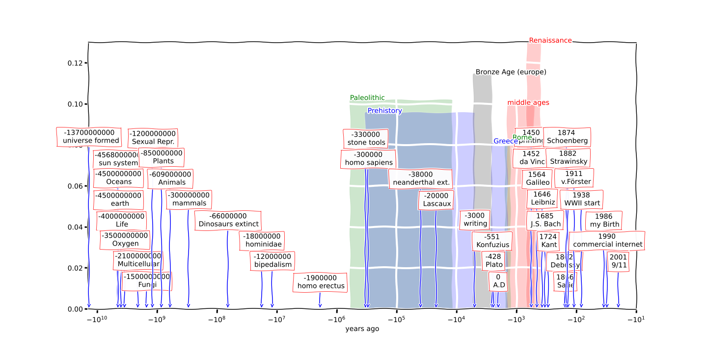

# Log History
Following an idea of Heinz von Förster, this is a logarithmic plot of all history for better personal understanding.

## Use
Edit the data.csv or periods csv and plot it again locally using jupyter-lab, or [use google colab to edit the appearance and data online](https://colab.research.google.com/github/hrtlacek/logHistory/blob/main/history.ipynb).

 ## Example Plot
 

## References
Von Foerster, H. (1950). Quantum mechanical theory of memory. In Cybernetics: Transactions of the Sixth Conference. New York (pp. 112-145).
